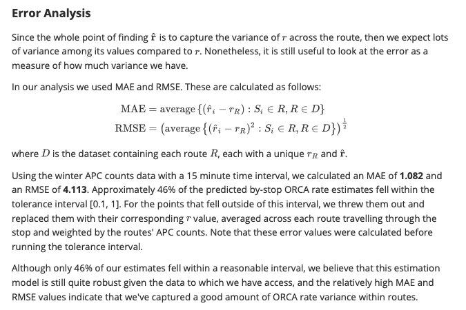

# Major-Dudes
Repository for Major Dudes

### Setup
* Ensure python 3.9 in installed
* (Reccommended) activate a python3.9 virtual environment in the top-level directory
* Install requirements: `make bootstrap`

### Running Pipelines
* `make [pipeline number]` (p1, p2, etc.)
* Output directory: data/pipeline_outputs

### Misc
* Since we don't have CI right now, make sure to run `make` before committing/pushing, and resolve any errors

### Calculation of By-Stop ORCA Penetration Rates

