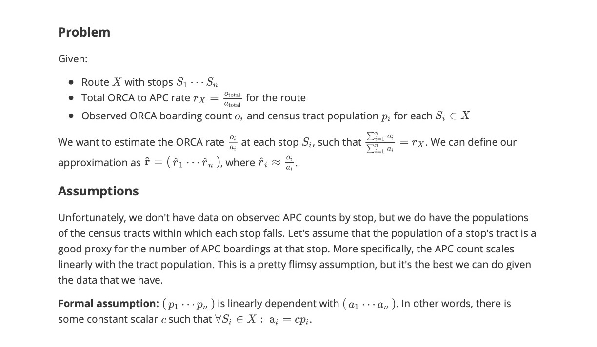

# Analysis of ORCA Ridership in King County
**CSE 482, Winter 2021**

### Participants

* Kristofer Wong - Undergraduate, Allen School
* Pierce Kelaita - Undergraduate, Allen School
* (Advisor) Mark Hallenbeck - Director, Washington State Transportation Center (TRAC)

### Overview

Many people in King County rely on the King County Metro's extensive bus system to get around. ORCA cards, issued by KCM and other transportation agencies, offer an easy way for riders to access the system and for agencies to collect data on riders to improve their services. However, not all populations have equal access to ORCA cards. This project aims to provide a robust model and intuitive interface to allow agencies to explore trends in ORCA card access in different commiunities across the county.

### Project Goals

Our project has 3 main goals that we've refined over the course of the past quarter. The first is to determine the ORCA card penetration rate among Washington state census respondents by census tract in King County. Census tracts are mid-sized groups of census blocks which have roughly equal populations, typically in the low thousands in King County, so we felt they were a good sized chunk on which to develop our analysis.

The second goal is to provide insight into how different subsets of the population have different levels of access to ORCA cards. For this, we looked at sex, race, income, and disability as factors to estimate a given person's of likelihood of carrying an ORCA card, based on King County census data as well as KCM transportation data.

Finally, our third goal is to provide an easy-to-use GUI allowing users to interact with our models to explore trends with a high level of granularity.

Additionally, we aimed to provide a high level of code quality, modularity, and scalability to support future development endeavors on our work.

**Screenshot of the GUI:**

### Development

Initially, we aimed to answer the broad question, "How equitably are ORCA cards distributed among King County residents?" Development on this project started with a joint effort between us, our advisor, Mark, and some of his colleagues at TRAC to get access to data that could not only answer our question but allow us to refine and formalize the question itself.

##### The Data & Pipelines
From these initial efforts, we were able to gain access to 3 transportation datasets - ORCA boardings by bus route and latitude-longitude coordinates, Automatic Passenger Count (APC) and predicted ORCA boardings by entire bus routes, and a map from each bus stop to its lat-lon coordinates. From here, we began work analysis to take these datasets and estimate the ORCA rate by bus stop. This phase of the project took a considerable amount of time and required 5 separate data pipelines to complete.

Concurrently, we began work on mapping these by-stop estimates to census tracts. In order to do this, we used Washington State Census's API to generate datasets containing information on each tract's population, geographic boundaries, and demographic features (age, race, sex, income, disabilty). With this data, we had to make the major assumption that each specific demographic has a fixed ORCA rate within King County. We recognize this is not a very robust assumption, but it was necessary with the limited data we had access to. Once we had this data, we were able to make our final estimates of by-stop ORCA rates by using tract populations as a proxy value for APC counts within that tract, making the assumption that the two values are directly proportional. More information on this algorithm can be found in the appendix.

##### Our Model
When our data pipeline efforts were nearing a close, we began work on the demographic model. We settled on an architecture taking demographic features as inputs and the likelihood of a person with these features to hold on ORCA card as an output. The training data consists of census data on the number of each demographic features per tract, and the output of our data pipelines (i.e., by-stop and by-tract estimated ORCA penetration rates). Given the nature of our training data, we decided to use an RBF kernel to expand the dimensions of our inputs from 5 to 290, and fit those features with training output through linear regression based on `y = W*PHI`, where`PHI` is the output matrix from our kernel and `W` is the linear regression matrix we are training. On prediction, we fed the output of this regression into a sigmoid function to constrain it on the [0,1] probability interval. We recognize that this is not a very robust approach, as we do not train the model with a sigmoid, yet we predict results with a sigmoid output, but it is the last stable model we were able to develop. We spoke with our Machine Learning advisor, Motoya, last week and spent the past week attempting to implement changes to make this model more robust, but ran into a lot of bugs in developing our new model and unfortunately had to revert back at the last minute. Given more time, and based off our conversations with Motoya, our model would be a generalized linear model, which, similar to our current model, uses an RBF kernel to expand the dimensions of our input from 5 to 290. It then would then do linear regression on a similar equation to before, `y = σ(W * PHI)`. We would calculate `W` by running a gradient descent on the squared loss, `||y-σ(WPhi)||^2` with respect to `W`. This would be more robust, as we would have learned `W` using a sigmoid, so predictions using the sigmoid would be more accurate.

As stated before, we made the assumption that each specific demographic has a fixed ORCA rate within King County. A couple other assumptions we made with our model include:
- The hyperparamter we used as the number of dimensions we expand to in our kernel, 290, being less than the number of data points we have, 295, be allow for good predictions. We note here that as the number of data points increase, this assumption is less restrictive.
- The demographics we use are independent of each other. For example, a person being Male at some location in King County is independent of that person's income. We acknowledge that this is not true, but it is a necessary assumption to make given the data we have access to. This is something to improve on in the future to make our model less biased.
- We only sampled 5000 demographic combinations in each location in King County, which might be small, but this is something that can be edited / tuned in the future make the model better.

##### User Interface
Finally, we developed a web application for our UI. We decided to use a client-server architecture with a MongoDB backend communicating with a React frontend via a Python Flask REST API. Development on the web portion of this project was done concurrently with the model as well as parts of the data pipeline, so we designed it to take advantage of some of the properties of our analyses. For example, while generating the model's training data takes a significant amount of time, training the model is relatively quick, so we opted for a design which re-trains the model on server startup and caches the tensors in the database. Additionally, we noted that our pipeline P5, which estimates by-tract ORCA rates, runs quite fast, so we employ a similar technique here. These techniques have the advantage that tweaks can be made to our analyses and easily re-ran with little to no additional architecture changes throughout the software.

### Constraints and Limitations

The first and most obvious limitation of our project is the short time in which we had to complete it. The entire process of refining our projcet idea, collecting data, developing, and performing user testing was done in a 10-week period - the length of UW's winter quarter on the quarter system. Because of this, we had to sacrifice a number of features, about which we go into more detail below.

Additionally, we were heavily constrained by the level of granularity in the data to which we were able to gain access. Unfortunately, we were not under NDA and unable to gain access to anything at the individual rider level, since that could be classified as Personally Identifiable Data (PID), which presents a significant security risk. Moreover, while the data we were provided contained accurate measurements of ORCA counts by stop as well as predicted ORCA : APC ratios by route, we were not able to gain access to data or estimations on ORCA : APC rates by stop. Because of this, we had to devote a significant portion of development time to our data pipeline in order to design our own by-stop ORCA rate estimates, which are based on the likely flimsy assumption that APC counts at a given stop scale directly with the populations of the tract within which the stop falls. Additionally, we focused less time on the machine learning model and web application frontend than we would have liked as a result of significant development time on the data pipeline.

### User Testing
In our user testing, we came across a few common trends:
- Users felt that in order to determine the combination of demographics and location that are likely to have the lowest ORCA penetration rate or make any constructive conclusions from our data in general, it'd be more useful to have an ORCA estimate for any particular tract given the chosen demographics rather than the likelihood that their someone of their chosen demographics would live in any particular tract. This is in line with what we had hoped to implement eventually, allowing people to include location as an input to our model.
- Users felt that the organization of our interface wasn't really intuitive - the map was a great visual, but caused confusion between what we meant by estimated ORCA rate for King County as a whole vs per tract information.
- Users wanted more details / explanations of what our interface does to make it more usable.
- Users also felt that some sort of visual representation on the map, whether with color or some sort of shading to help users view how common people of their chosen demographics are to live in any particular location.

Unfortunately, given our time constraints, we were unable to model the ORCA rate for demographics at each census tract in order to add location as an input to our model. This is something we will leave for the future because we believe it is vital to helping people draw their own conclusions with our data about what populations in particular may be underrepresented by ORCA data. Additionally, we have a color gradient map implemented to satisfy the user feedback above, but it is unfortunately too buggy to push for our final product. Given more time, we would have liked to implement this color gradient on the map, where the color of each tract corresponds to its estimated ORCA penetration rate.

Some changes that we were able to implement within this class included:
- Rewriting the home page to include a more in-depth description of the product, as well as an ORCA card icon to provide a visual aid.
- Rewording descriptions of the tasks our users can achieve through our interface in response to feedback that users wanted more guidance to make our interface more usable. In particular, we changed the popups on tract information to show the overall tract ORCA percentage at the bottom, and hide the table when no data has been inputted.
- Added descriptions for each demographic based on how the census defines those demographics to help people like Mav decide what to select. This change added an ‘info’ button under the demographic selectors, which, when clicked, pops up with the descriptions.

### Conclusions and Future Direction

Overall, we are pleased with our development results and have recieved positive feedback from our peers and advisors. We hope that this project is able to make an impact in the King County transportation space, and that development by future maintainers is possible.

In terms of future development, we have hopes to expand on all three components of the project. For the data pipeline, we'd like to do a robust analysis of the level of bias on our by-stop ORCA rate estimates. In order to do this, we'd likely need access to some real by-stop ORCA rates to act as a source of truth. Even a relatively small sample of stops could be instrumental in verifying the validity of our estimates and iterating on top of the analysis. For the model, we'd like to perform similar validation on its accuracy using real-world data. Accessing this data, however, could pose significant difficulties as it would likely be classified as PID. Finally, we'd like to make a number of improvements to the overall user experience on the frontend, as we devoted a relatively small amount of development time towards it. Stretch goals for this project include Dockerizing its components and hosting on AWS and publishing it on an official SDOT listing.

## User Manual

### Required Installations

* Python 3.9
  * Packages: pip and virtualenv (latest compatible with Python version)
* MongoDB Community Edition >= 4.4.1
* NodeJS >= 14.15.3 / npm (latest compatible with Node version)
* Browser which supports React ([docs](https://reactjs.org/docs/react-dom.html))
* GNU Make

### Setup

* Navigate to the root directory of this project
* Activate a Python virtual environment. We used virtualenv, and the software has not been tested in other environments such as Conda.
  * `python -m pip install virtualenv`
  * `python -m venv venv`
* Install dependencies: `make bootstrap`

### Running Pipelines

* Run a specific pipeline: `make [pipeline number]` (p1, p2, etc.)
* Run all pipelines: `make all`
* Output directory: *data/pipeline_outputs*

### Generating Training Data

* `make training`
* This takes quite a while, so we've included the training data in the repo. If any of the training data generation dependencies (pipelines, sampling script in model) are modified, the above command will re-generate the data.

### Running the Web Server

* Initialize a MongoDB instance: `mongod`
  * On MacOS Catalina and later, the above command will result in error, so you can use `mongod --dbpath ~/data/db`, or define your own other custom path for `data/db`, the directory used by Mongo to store entries
* Start the server: `make server`
  * This will default to run on port 5000, but this can be changed by setting the environment variable `PORT`, or by providing a different default value in *server/config.py*
* Start the client: `cd client && npm i && npm start`
  * This will default to run on port 3000, but this can be changed by setting the environment variable `REACT_APP_PORT`
* Navigate to *localhost:3000* in your browser, or whatever custom port you've set for React.

## Appendix - Calculation of By-Stop ORCA Penetration Rates

